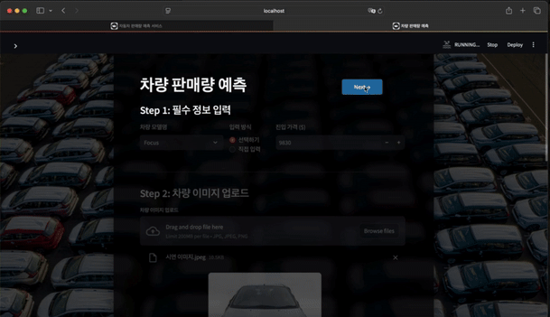

# 재고 절감을 위한 생산량 최적화


## Intro

본 프로젝트는 다양한 산업에서 발생하는 재고 문제를 해결하기 위한 
AI 모델 및 서비스를 개발하는 것을 목표로 합니다.

재고 문제는 산업 전반에 걸쳐 발생하며, 과잉 재고는 기업의 경제적 
손실과 환경적 부담을 초래할 뿐만 아니라 시장 경쟁력에도 부정적인 
영향을 미칩니다. 이를 해결하기 위해, 본 프로젝트에서는 자동차 산업 
데이터를 활용하여 판매량을 예측하고, **입력되지 않은 자동차 옵션을 
추론하여 최적의 구성 요소를 추천하는 모델**을 개발합니다.
<br/>
<br/>

## 웹 페이지 구성
### 1. 차량 정보 입력 페이지


### 2. Result 페이지



## Installation


### environment settings
```
apt update
apt install -y git
git clone https://github.com/boostcampaitech7/level4-cv-finalproject-hackathon-cv-17-lv3.git
cd level4-cv-finalproject-hackathon-cv-17-lv3

pip install -y requirements.txt

apt install -y libgl1-mesa-glx libgl1-mesa-dev
apt install -y libglib2.0-0
```

### run streamlit
```
streamlit run run_streamlit.py
```
<br>
모델 checkpoint는 아래 링크에서 받아 configs/models 폴더에 넣어주시면 됩니다.<br>
[huggingface](https://huggingface.co/Gwonee/BODA)
<br><br>

**예시 데이터**<br>
| 항목               | data/examples/ex_image1.jpg  | data/examples/ex_image2.jpg |
|:-------------------|:---------------------------------------------------:|:-----------------------------------------------:|
| **제조사**          | Ford                                                | Citroen                                         |
| **차체 유형**        | Hatchback                                           | Hatchback                                       |
| **차량 색상**        | Green                                               | Yellow                                          |
| **연료 종류**        | Petrol                                              | Diesel                                          |
| **변속기 종류**       | Manual                                              | Manual                                          |
| **좌석 수**          | 5                                                   | 4                                               |
| **도어 수**          | 5                                                   | 3                                               |
| **엔진 배기량 (L)**   | 1.6                                                 | 1.6                                             |
| **진입 가격 (USD)**   | 9,830                                               | 11,635                                          |
| **최초 출시 연도**     | 2001                                                | 2009                                            |
| **출시 연도**         | 2003                                                | 2011                                            |
| **차량 길이 (mm)**     | 4,152                                               | 3,948                                           |
| **차량 너비 (mm)**     | 1,998                                               | 1,715                                           |
| **차량 높이 (mm)**     | 1,430                                               | 1,483                                           |
| **축거 (mm)**         | 2,615                                               | 2,464                                           |


</div>


## Team ( CV-17 : BODA)

<table>
    <tr height="160px">
        <td align="center" width="150px">
            <a href="https://github.com/Bbuterfly"></a>
            <br/>
            <a href="https://github.com/Bbuterfly"><strong>김기수</strong></a>
            <br />
        </td>
        <td align="center" width="150px">
            <a href="https://github.com/sweetpotato15"></a>
            <br/>
            <a href="https://github.com/sweetpotato15"><strong>김유경</strong></a>
            <br />
        </td>
        <td align="center" width="150px">
            <a href="https://github.com/joonhyunkim1"></a>
            <br/>
            <a href="https://github.com/joonhyunkim1"><strong>김준현</strong></a>
            <br />
        </td>
        <td align="center" width="150px">
            <a href="https://github.com/Heejin1002"></a>
            <br />
            <a href="https://github.com/Heejin1002"><strong>여희진</strong></a>
            <br />
        </td>
        <td align="center" width="150px">
            <a href="https://github.com/Two-Silver"></a>
            <br />
            <a href="https://github.com/Two-Silver"><strong>이은아</strong></a>
            <br />
        </td>
        <td align="center" width="150px">
            <a href="https://github.com/Gwonee"></a>
            <br />
            <a href="https://github.com/Gwonee"><strong>정권희</strong></a>
            <br />
        </td>
</table> 


